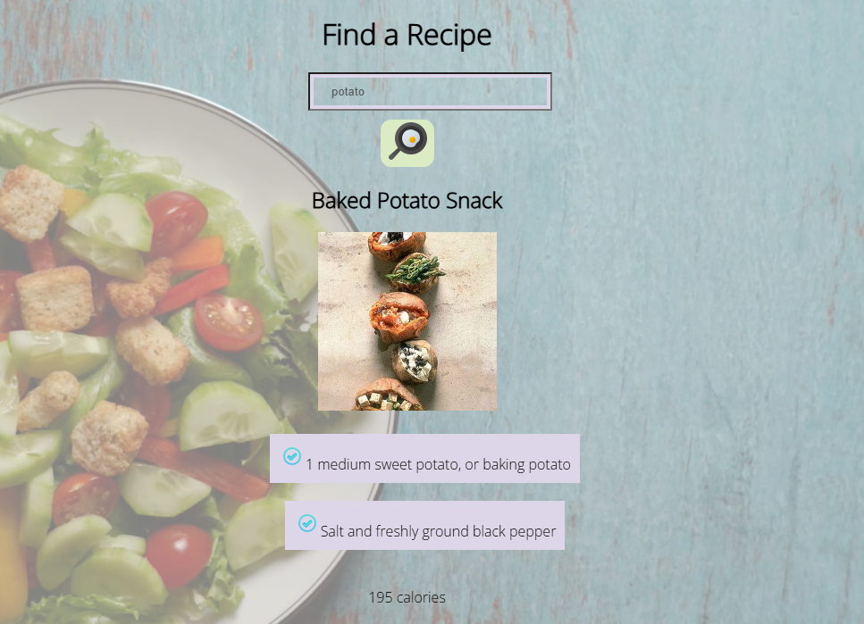

# React + Vite

This template provides a minimal setup to get React working in Vite with HMR and some ESLint rules.

Currently, two official plugins are available:

- [@vitejs/plugin-react](https://github.com/vitejs/vite-plugin-react/blob/main/packages/plugin-react/README.md) uses [Babel](https://babeljs.io/) for Fast Refresh
- [@vitejs/plugin-react-swc](https://github.com/vitejs/vite-plugin-react-swc) uses [SWC](https://swc.rs/) for Fast Refresh
  
---

# Recipe Finder

A sleek and functional recipe search application. With **Recipe Finder**, users can input ingredients and discover delicious recipes that include them. This project is a learning exercise that utilizes React hooks and an external API to demonstrate modern front-end development techniques.

---

## Screenshot

    

---

## Features

- **Ingredient-based search**: Enter ingredients in the search bar to find recipes that include them.
- **Dynamic rendering**: Recipes are displayed using reusable components with props.
- **API integration**: Fetches recipes from a rich external API database.
- **Modern React**: Implements `useState` and `useEffect` for state management and side effects.

---

## Built With

